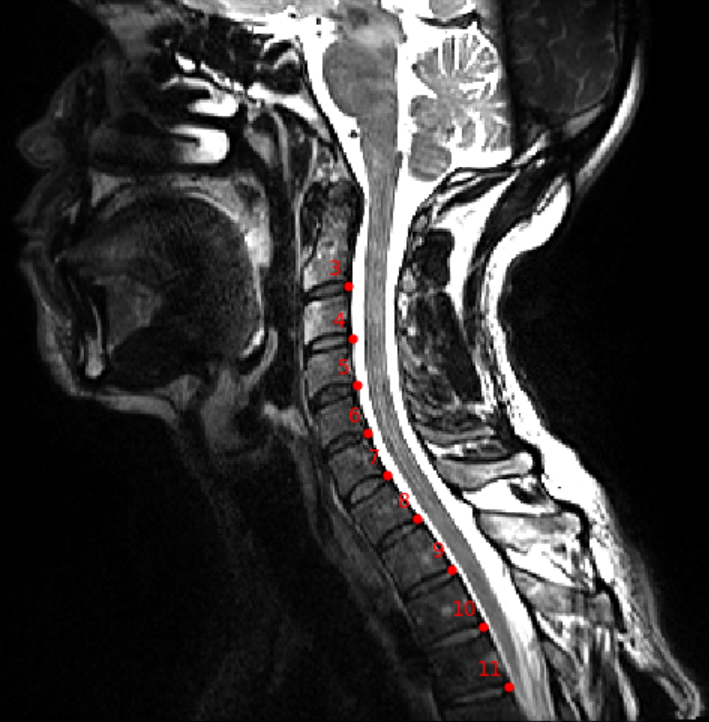

this script is made for manual labeling of BIDS folder
run the script with python
python manual-labeling/manual_labeling.py -file list_todo_update.txt -author lucas -path Path_to_duke/ \[-correct 1 -o label_tmp\]

- -file: txt file that contains the list of all images inside bids root folder that you want to process separated by '\n'.The format in sub-xx/anat/sub-xxx_xxx.nii.gz. Can be obtained with get_bids_sub.py.
- -path : Path th Bids root folder (duke) with a '/' at the end
- -author: Author name that will appear on the .json file 
- -correct: Boolean. default is 0. If correct is 1, the script will look for existing label and open them with the -ilabel option from sct_label_utils so you can verify/correct existing label.
- -o: in the output folder given by the 5th argument, you will find in BIDS convention sub-xxx/anat/sub-xxx_SUFFIX_OF_LABEL.nii.gz and sub-xxx/anat/sub-xxxSUFFIX_OF_LABEL.json" if this is empty this will save under BIDS_PATH/derivatives/labels/sub-xx/anat/xxx

to end : performa keyboard interrupt from the terminal (ctrl+c). This will update the list by deleting the viewed subjects. don't forget to commit and push it on github. 
Specific:
possible file suffix to file are _acq-sag_T2w, _T2w, _T1w, _acq-sagcerv_T2w
suffix to label is labels-disc-manual
Example image for manual labeling:

